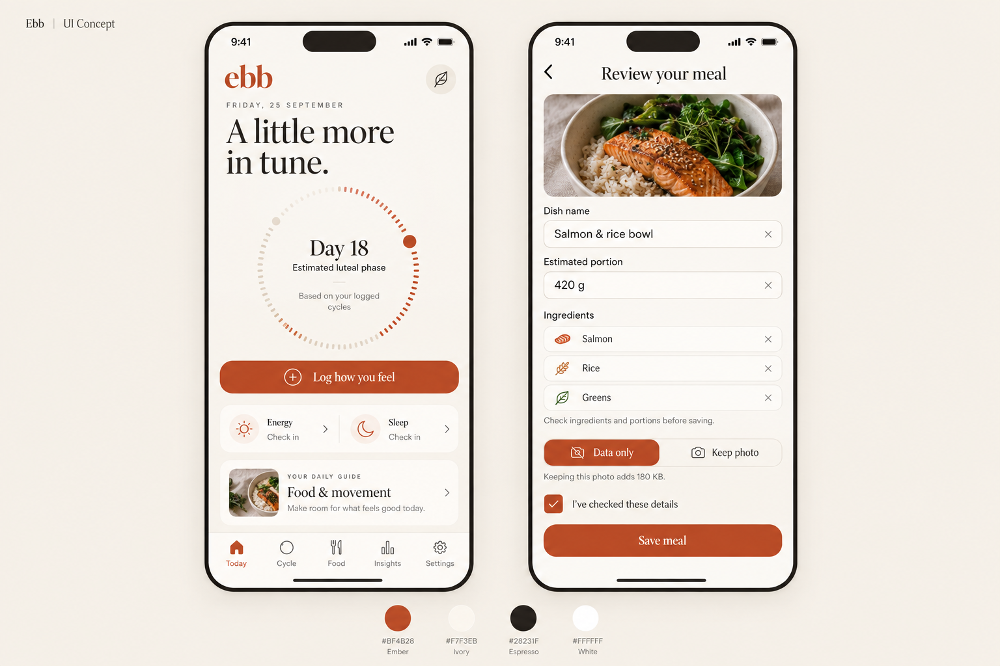

<div align="center">
  
  <h1>Ebb</h1>
  <p><strong>Your cycle, on your terms.</strong></p>
  <p>A private cycle and wellbeing diary for iOS and Android.<br />Periods, patterns, daily check-ins and meals — with your diary stored on your device.</p>
  <p>
    
    
    
    
  </p>
</div>



*Ivory & Ember — an AI-generated visual direction for Ebb, not a screenshot of the current build. The current app uses an ivory-and-orange interface; this refined design is an exploration.*

## A diary that belongs to you

Ebb brings cycle tracking, everyday wellbeing and meal logging together without an Ebb account, advertising or analytics. Log only what matters to you, look for patterns across your own history, and export your records whenever you choose.

- **Track your cycle.** Periods, flow, spotting, calendar edits and next-period estimates with an expected range.
- **Check in with yourself.** Symptoms, mood, energy, sleep, pain and daily impact, plus optional temperature, tests, medication, movement and custom trackers.
- **Understand your patterns.** Cycle history, recurring symptoms, temperature charts and comparisons that account for missing observations.
- **Explore food and movement.** Meal ideas and activity options with everyday fallbacks when cycle timing is uncertain.
- **Keep a meal diary.** Manual logging on both platforms; optional on-device photo recognition on Android. Review the dish, likely ingredients and approximate portions before saving. Keep a compressed photo or save just the meal details. Calories are optional.
- **Bring your history.** Import supported Flo export files, restore an Ebb JSON backup, or read supported records from Apple Health.
- **Connect health data.** Optional read-only Apple Health and Android Health Connect imports. These use the phone's health store; Ebb does not pair directly with a watch.
- **Stay in control.** Optional PIN/biometric lock, discreet reminders, configurable trackers, light/dark themes, JSON backup, CSV export and deletion controls.

## Where the project stands

**Version 1.4.0 · In development · Native device testing ongoing.**

| Capability | Android | iOS |
| --- | --- | --- |
| Cycle diary, check-ins and insights | Implemented | Implemented |
| Manual meal logging and photo retention | Implemented | Implemented |
| Local AI meal-photo recognition | Implemented; device validation pending | Not implemented |
| Health integration | Health Connect: sleep and resting heart rate | HealthKit: supported cycle records, sleep and resting heart rate |
| Distribution | Personal sideload builds | Build/signing workflow prepared; no public TestFlight link |

The native food module supports optional Gemma 4 E2B/E4B downloads on Android. Model weights are **not** included in this repository or the app package. Installation is verified and kept in persistent private storage. Photo recognition requires compatible hardware and still needs real-device performance and accuracy validation.

**Cycle and ovulation predictions are estimates, not contraception. Ebb is not a medical device and does not diagnose, treat or prevent conditions.** Food-photo suggestions are also estimates and require user review.

## Privacy, in practical terms

- Diary processing and health imports happen on the device. There is no Ebb backend or account system.
- Optional model downloads contact the model host; Ebb does not attach diary records or meal photos to those requests. Source links open external websites.
- Exports are files you explicitly create and choose to share. JSON backups include meal details but do not embed photos or model files.
- Retained photos and model files use private storage excluded from OS backup. Ordinary diary storage relies on platform protections; it does not have a separate app-level encrypted database. App lock controls access through Ebb's UI.
- Uninstalling removes private app data. Export a backup before changing devices; install updates over an existing installation when preserving data and models.

See [food storage and recognition](FOOD_LOGGING.md) and the [privacy policy template](store/privacy-policy.md) for details. Store submission metadata is a draft and must be reviewed before release.

## Run locally

Use Node.js **22.13 or newer** and npm. Install the locked dependencies:

```sh
npm ci
npm run web
```

The web preview is useful for the interface and diary flows. Native capabilities such as health imports, biometric lock and model inference need a native build; **Expo Go does not include Ebb's custom native module**.

### Android

Install Android Studio, an Android SDK and a compatible JDK, then run:

```sh
npm run android
```

For a standalone personal-testing APK:

```sh
./scripts/build_android.sh
```

The script generates the native project and writes to the ignored `releases/` directory. Its defaults target a macOS Android Studio installation; set `JAVA_HOME` and `ANDROID_HOME` for another setup. Personal-testing builds use the default debug signing identity. Configure your own release signing before store distribution; never commit signing keys.

### iOS

Use macOS with Xcode and CocoaPods. Generate the workspace, apply the project's build-path fixes, and install pods:

```sh
npx expo prebuild --platform ios --no-install
node scripts/fix_ios_build_paths.cjs
(cd ios && pod install)
open ios/Ebb.xcworkspace
```

Choose your development team and device in Xcode. Signing credentials and developer membership are not included. See [iOS testing](IOS_TESTING.md) and [TestFlight setup](TESTFLIGHT.md) for the existing build workflow. iOS currently supports manual meal/photo logging, not local AI food recognition.

## Validate changes

```sh
npm run typecheck
npm run test:unit
```

For browser interaction tests, keep the web preview running on port 8081 in another terminal:

```sh
npm run web -- --port 8081
npx playwright install chromium
npm test
```

Unit tests cover cycle calculations, imports, meal parsing and model-download lifecycle behavior. Playwright exercises diary and review flows. Passing browser tests does not establish native health permissions, camera behavior or AI performance on a phone.

## Inside the project

| Path | Purpose |
| --- | --- |
| `src/screens/` | Onboarding, diary, calendar, insights, food and settings |
| `src/components/` | Shared controls, icons and visualizations |
| `src/logic/` | Cycle engine, imports, exports, health bridges and meal handling |
| `src/state.tsx` | App state and local persistence |
| `modules/ebb-local-ai/` | Native Android inference and Android/iOS model storage |
| `plugins/` | Reproducible Expo native-project configuration |
| `tests/` | Unit and browser tests |
| `scripts/` | Build and asset-generation helpers |
| `store/` | Draft store descriptions, privacy and review information |

Generated native projects, dependencies, release packages, local credentials and model binaries are intentionally excluded from Git. Expo prebuild recreates the native projects from the checked-in configuration and plugins.

## Read more

- [Prediction and insight design](INSIGHTS.md)
- [Health and wearable integrations](WEARABLES.md)
- [Meal logging and device checks](FOOD_LOGGING.md)
- [Native AI runtime](modules/ebb-local-ai/README.md)
- [Research notes](RESEARCH.md)

## Feedback and reuse

When reporting a bug, include the app version, phone model, OS version and steps to reproduce. Use synthetic examples rather than personal health records, exports or unredacted screenshots.

An open-source license has not been selected yet. Public repository access alone does not grant an open-source license. Third-party dependencies and optional model weights remain subject to their own terms.
